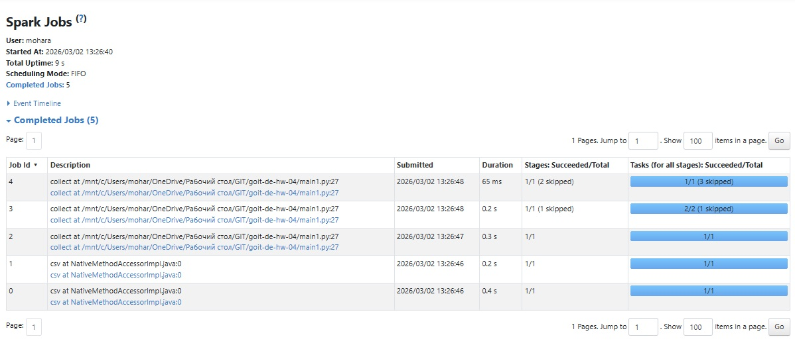
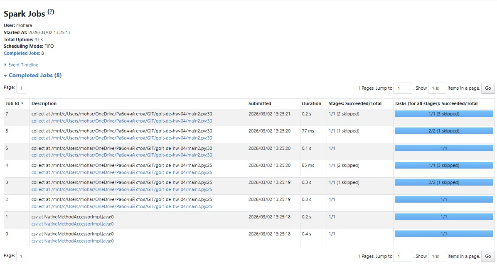
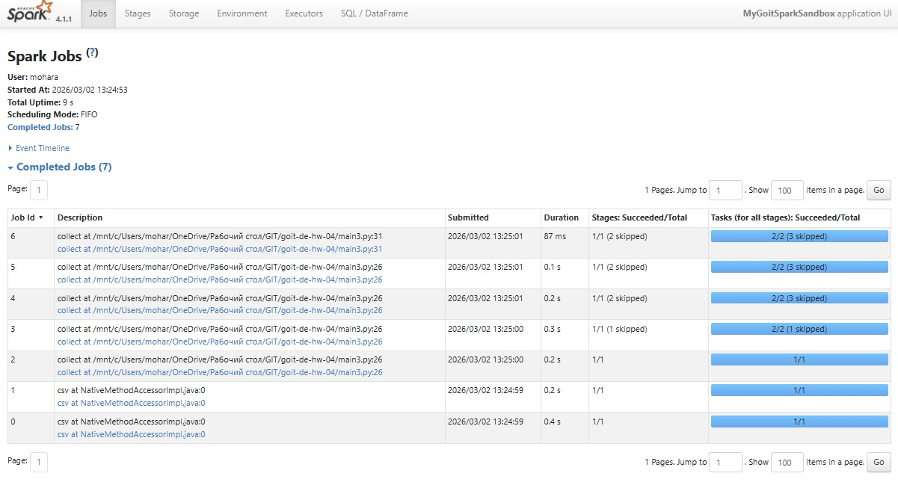

# goit-de-hw-04

Висновки
Для першого експерименту в нас 5 етапів, тож ми отримуємо 5 jobs:
-	завантаження ;
-	десереалізація;
-	repartition;
-	фільтрація + групування;
-	фільтрація + групування + забирання (collect).
Для другого експерименту ми отримуємо 8 jobs:
-	завантаження ;
-	десереалізація;
-	repartition;
-	фільтрація + групування;
-	фільтрація + групування + забирання (collect).
-	repartition;
-	фільтрація + групування;
-	фільтрація + групування + забирання (collect).

Для третього експерименту ми отримуємо 7 jobs:
-	завантаження ;
-	десереалізація;
-	repartition;
-	фільтрація + групування;
-	фільтрація + групування + забирання (collect) + запис в кеш.
-	читання з кешу;
-	фільтрація + групування + забирання (collect).

При третьому експерименті  кількість робіт зменшується на одну адже ми використовуємо закешовані дані замість повторного виклику repartition та фільтрація + групування. Це економить час та ресурси не повторюючи тяжкі операції, використовуючи швидку оперативну пам’ять.

